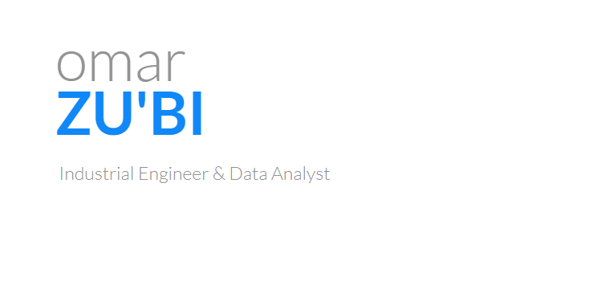

  
**[[See Website ↗︎](https://drzubi.github.io/PersonalWebsite/)]**

****

## Hi there 👋 

Welcome to my GitHub account, where innovation meets passion! I am thrilled to share my coding journey with you and showcase my projects and contributions in the world of software development.

As you explore my repositories, you will uncover a diverse collection of projects that reflect my curiosity, dedication, and growth as a developer. From web applications to machine learning models, I have ventured into various domains, constantly seeking new challenges and opportunities to expand my skills.

Each line of code represents not only a solution to a problem but also a stepping stone in my continuous learning process. I believe in the power of collaboration, and my repositories are a testament to my commitment to open-source development. By leveraging the collective knowledge of the developer community, I strive to create impactful and scalable solutions.

Behind every commit and pull request lies a story of perseverance, creative problem-solving, and the sheer joy of building something from scratch. GitHub has been my trusted companion throughout this journey, allowing me to track changes, manage versions, and collaborate seamlessly with fellow developers.

But GitHub is not just about code. It's a platform that fosters growth, encourages collaboration, and celebrates the spirit of innovation. I invite you to join me in this exciting adventure, explore my projects, and contribute to the ever-evolving world of software development.

Together, let's push boundaries, inspire others, and make a lasting impact in the world of technology. Welcome to my GitHub account, where innovation comes to life!

---
## Quick Facts
- 🚀 I mostly program in Python, R, and SQL
- 🎓 Purdue University BS Industrial Engineering Graduate
- 🎓 UC Berkeley Masters in Information and Data Science
- 💼 Data Analyst @ Sam Schwartz Engineering
- 📈 Tableau and Microsoft Power BI Expert
- 🌱 Currently learning Rust Programming
- 💬 Ask me about mochi!
---
<h3> ⚙️Languages and Tools: </h3>

---

<!---  More about shields: https://shields.io/ & https://gist.github.com/afig/be5ab20c50062dba7cb835e30206659a -->

